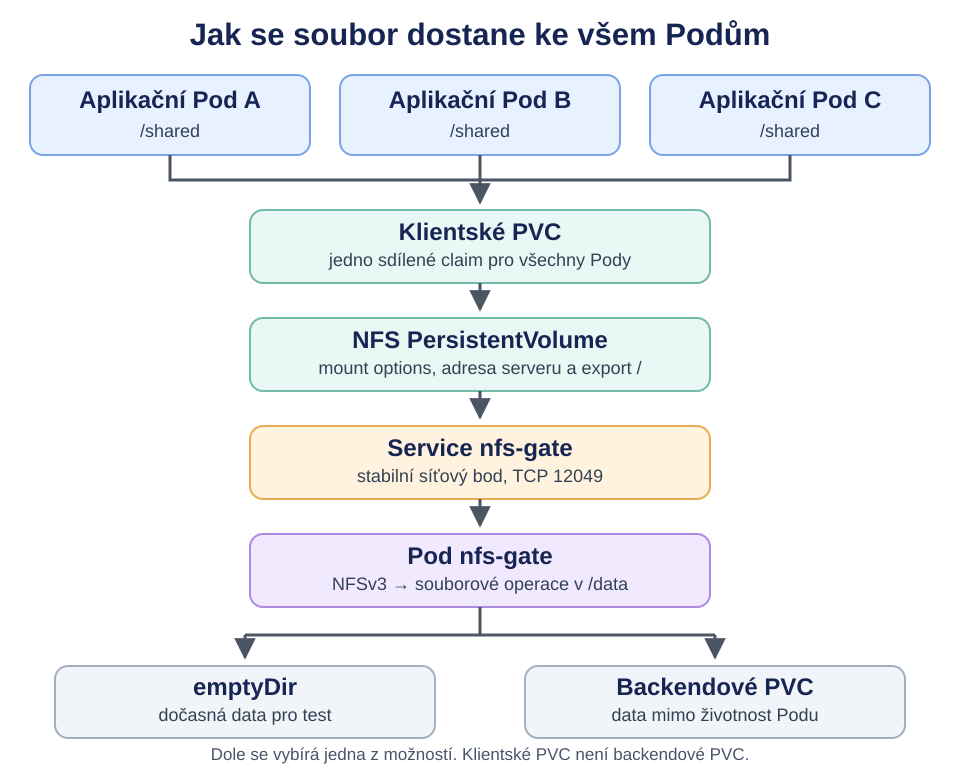
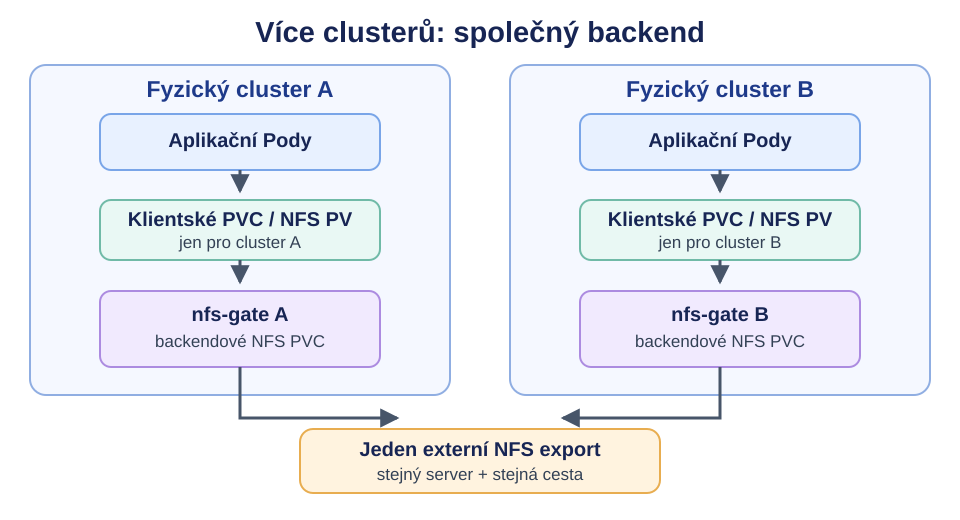
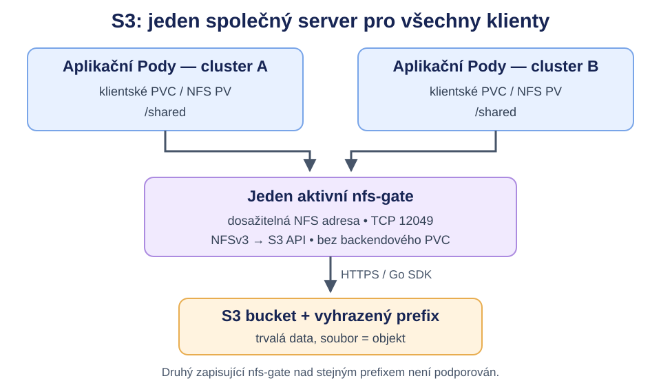

# nfs-gate: společné soubory pro více Podů

## Jednoduše řečeno

`nfs-gate` zpřístupní jeden adresář nebo S3 bucket/prefix jako NFSv3 share. Více aplikací, klidně na různých uzlech Kubernetes, si tento share připojí jako běžný adresář. Když jedna aplikace vytvoří nebo změní soubor, ostatní pracují se stejným adresářem a změnu po aktualizaci své NFS cache uvidí.

{width=90%}

**Dvě různé role:** Klientské PVC je způsob, jakým si aplikace připojí NFS export. Naproti tomu backendový svazek je adresář, ze kterého `nfs-gate` data skutečně čte a do kterého zapisuje. Pro test může být backend `emptyDir`; pro data přesahující životnost serverového Podu může být backend samostatné PVC nebo přímo připojený externí NFS export. Třetí možností je S3: server překládá souborové operace přímo na objektové API a backendové PVC vůbec nepotřebuje. Klientské PVC zůstává ve všech variantách stejné; `nfs-gate` žádné PVC automaticky nevytváří.

**Co je vidět v UI:** server má jednoduché read-only UI se stavem, posledními NFS operacemi a seznamem souborů. Obsah souborů nevydává. Historie zachycuje pouze operace, které prošly přes tento server; změny provedené přímo v backendu se objeví v seznamu souborů, ale ne v historii.

**Důležitá hranice:** `emptyDir` je vhodný pro ukázku. Při odstranění nebo nahrazení serverového Podu se jeho data smažou. NFS klienti také mohou mít po restartu serveru neplatné file handly a potřebovat nové připojení. Stabilní adresa Service sama o sobě data ani handly nezachová. [Kubernetes: emptyDir](https://kubernetes.io/docs/concepts/storage/volumes/#emptydir)

## Technické detaily {#technicke-detaily}

### 1. Server s backendem `emptyDir`

V testovací variantě má serverový Pod jeden adresář `/data`. Kubernetes ho naplní svazkem `emptyDir` a `nfs-gate` jej exportuje na TCP portu 12049. Následující části tvoří jeden Deployment a Service. Image musí být dostupný z registru daného clusteru.

```yaml
apiVersion: apps/v1
kind: Deployment
metadata:
  name: nfs-gate
spec:
  replicas: 1
  strategy:
    type: Recreate
  selector:
    matchLabels: {app: nfs-gate}
  template:
    metadata:
      labels: {app: nfs-gate}
    spec:
      securityContext:
        runAsNonRoot: true
        runAsUser: 65532
        runAsGroup: 65532
        fsGroup: 65532
      containers:
        - name: nfs-gate
          image: <registry>/nfs-gate:<tag>
          args: ["--root=/data", "--listen=:12049"]
          ports:
            - {name: nfs, containerPort: 12049}
          volumeMounts:
            - {name: data, mountPath: /data}
      volumes:
        - name: data
          emptyDir: {}
---
apiVersion: v1
kind: Service
metadata:
  name: nfs-gate
spec:
  selector: {app: nfs-gate}
  ports:
    - {name: nfs, port: 12049, targetPort: nfs, protocol: TCP}
```

`emptyDir` přežije restart kontejneru ve stejném Podu, ale je odstraněn spolu s Podem. Je-li potřeba trvalejší backend, použijte krok 4. [Kubernetes: emptyDir](https://kubernetes.io/docs/concepts/storage/volumes/#emptydir)

### 2. Klientský PV a PVC

Klient potřebuje **statický NFS PersistentVolume**, protože mount používá nestandardní port. PV je objekt clusteru; PVC vzniká v namespace aplikací. Do pole `server` dosaďte adresu, na kterou se dostanou *uzly* Kubernetes. V některých clusterech lze použít ClusterIP Service, pokud ji uzly směrují. DNS jméno `*.svc.cluster.local` je garantováno Podům, ne nutně samotným uzlům. Uzly také potřebují NFS mount helper.

```yaml
apiVersion: v1
kind: PersistentVolume
metadata:
  name: nfs-gate-shared
spec:
  capacity: {storage: 1Gi}
  accessModes: [ReadWriteMany]
  persistentVolumeReclaimPolicy: Retain
  storageClassName: ""
  mountOptions:
    - nfsvers=3
    - proto=tcp
    - port=12049
    - mountvers=3
    - mountport=12049
    - mountproto=tcp
    - nolock
  nfs:
    server: <adresa-dostupna-z-uzlu>
    path: /
---
apiVersion: v1
kind: PersistentVolumeClaim
metadata:
  name: nfs-gate-shared
spec:
  accessModes: [ReadWriteMany]
  storageClassName: ""
  volumeName: nfs-gate-shared
  resources:
    requests: {storage: 1Gi}
```

`storageClassName: ""` brání tomu, aby se toto PVC svázalo s výchozí dynamickou StorageClass. `1Gi` u NFS PV je deklarovaná kapacita pro Kubernetes, nikoli automatická kvóta. `nolock` nepoužívá `rpc.statd`; `nfs-gate` distribuované zámky neposkytuje. Mount options nelze zadat přímo do inline `nfs:` volume v Podu. [Kubernetes: NFS volumes](https://kubernetes.io/docs/concepts/storage/volumes/#nfs), [PersistentVolumes](https://kubernetes.io/docs/concepts/storage/persistent-volumes/#mount-options)

### 3. Tři klientské Pody

Všechny repliky používají **stejné klientské PVC**. Každá uvidí `/shared` a bude pracovat s jedním exportovaným adresářem. `nfs-gate` je stále jen jeden serverový Pod.

```yaml
apiVersion: apps/v1
kind: Deployment
metadata:
  name: shared-app
spec:
  replicas: 3
  selector:
    matchLabels: {app: shared-app}
  template:
    metadata:
      labels: {app: shared-app}
    spec:
      containers:
        - name: app
          image: <registry>/your-app:<tag>
          volumeMounts:
            - {name: shared, mountPath: /shared}
      volumes:
        - name: shared
          persistentVolumeClaim:
            claimName: nfs-gate-shared
```

Pro ověření stačí do `/shared` z jedné repliky zapsat soubor a z ostatních jej přečíst. Cache NFS klientů může krátce odložit viditelnost poslední změny.

### 4. Backendové PVC místo `emptyDir`

Pokud mají data přežít nahrazení serverového Podu, vytvořte pro server **druhé, odlišné PVC**. Jeho StorageClass a režim přístupu závisejí na skutečném backendu. Pro jeden serverový Pod často postačí `ReadWriteOnce`; zvolený typ úložiště musí být připojitelný na uzlu, kam se Pod přesune.

```yaml
apiVersion: v1
kind: PersistentVolumeClaim
metadata:
  name: nfs-gate-backend
spec:
  accessModes: [ReadWriteOnce]
  storageClassName: <vase-storage-class>
  resources:
    requests: {storage: 10Gi}
```

V serverovém Deploymentu nahraďte pouze definici svazku `data`; `volumeMounts` na `/data` a `--root=/data` zůstanou:

```yaml
volumes:
  - name: data
    persistentVolumeClaim:
      claimName: nfs-gate-backend
```

Klientské PVC `nfs-gate-shared` se tím nemění. Backendové PVC chrání data podle vlastností svého úložiště, ale neřeší restart NFS serveru, dostupnost při výpadku ani platnost starých file handlů.

### 5. Více fyzických clusterů {#5-vice-fyzickych-clusteru}

V režimu `--backend=local`, pokud běží samostatný `nfs-gate` v clusteru A i B a aplikace v obou clusterech musí vidět **jedny společné soubory**, musí mít oba servery pod `/data` **stejný externí NFS export a stejnou cestu**. `emptyDir` v každém clusteru je izolované a dvě běžná, nezávisle vytvořená PVC mohou ukazovat na různá data. Samotná shoda názvů PVC žádné sdílení nezajistí.

{width=85%}

Backendové PVC zde **není potřeba**. V Deploymentu `nfs-gate` v **každém** clusteru nahraďte `emptyDir` přímým `nfs` volume. Stávající `volumeMounts` na `/data` a `--root=/data` ponechte. Údaje v příkladu jsou zástupné:

```yaml
volumes:
  - name: data
    nfs:
      server: <externi-nfs-server>
      path: /spolecny-export
```

Hodnoty `server` a `path` musí být v obou clusterech stejné. Kubelet připojí upstream NFS do Podu; proces `nfs-gate` ho čte jako běžný adresář. Klientský NFS PV/PVC z kroku 2 se v každém clusteru vytvoří zvlášť a míří na **místní** Service `nfs-gate`, nikoli přímo na upstream NFS server.

Inline `nfs` volume neumí zadat mount options. Pokud externí NFS vyžaduje nestandardní port, konkrétní verzi protokolu nebo jiné volby, použijte místo něj backendový NFS PV/PVC s `mountOptions`, případně odpovídající konfiguraci uzlů. [Kubernetes: NFS volumes](https://kubernetes.io/docs/concepts/storage/volumes/#nfs)

Zkontrolujte dosažitelnost upstream NFS z uzlů obou clusterů, oprávnění pro UID/GID serverového procesu a skutečnou exportovanou cestu. Cache NFS může zpozdit změny mezi clustery a souběžné zápisy potřebují koordinaci v aplikaci. Společný upstream svazek zajistí společná data, ale sám o sobě neposkytuje HA pro `nfs-gate` ani stabilní file handly po restartu.

### 6. S3 backend {#6-s3-backend}

S3 umožňuje zachovat soubory bez datového svazku pod serverovým Podem. Klienti stále připojují NFS přes stejné PV/PVC a pracují s `/shared`. `nfs-gate` používá Go SDK, žádný externí mountovací proces. Soubor odpovídá objektu v bucketu; prázdné adresáře jsou nulové objekty zakončené `/` a atributy souborů jsou v metadatech `nfs-*`.

{width=85%}

**Právě jeden aktivní server pro daný bucket/prefix, i napříč clustery.** Na rozdíl od předchozí varianty s externím NFS nespouštějte druhý `nfs-gate` nad stejným S3 prefixem. Klientské PV ve všech clusterech musí mířit na společný server dosažitelný z jejich uzlů. Jedna replika a `Recreate` zabrání překryvu při běžné aktualizaci; při failoveru je potřeba zajistit zastavení původního procesu, protože server nemá distribuovaný zámek ani fencing.

Pro menší sdílené soubory je tato varianta použitelná. Každý zápis stáhne původní objekt podle potřeby a odešle celou novou verzi. Úspěch se klientovi potvrdí až po odpovědi S3. Není zde cache neodeslaných změn; při chybě S3 dostane klient chybu. U přerušeného požadavku může být výsledek nejistý a je nutné ověřit skutečný stav. Zápisy jsou serializované v jedné instanci; cache NFS klientů může viditelnost zpozdit.

#### Spuštění a Kubernetes

Bucket musí předem existovat. Lokální příklad:

```bash
./bin/nfs-gate --backend=s3 \
  --s3-bucket=your-bucket --s3-prefix=shared --s3-region=us-east-1
```

Přihlašování používá standardní AWS SDK řetězec: proměnné prostředí, AWS konfiguraci nebo workload identity/role. V Kubernetes nastavte identitu workloadu nebo samostatně vytvořte Secret `nfs-gate-s3` s `AWS_ACCESS_KEY_ID`, `AWS_SECRET_ACCESS_KEY` a případně `AWS_SESSION_TOKEN`. Hodnoty přihlašovacích údajů neukládejte do repozitáře. Role potřebuje `s3:ListBucket` pro prefix a `s3:GetObject`, `s3:PutObject`, `s3:DeleteObject` pro jeho objekty; pro SSE-KMS mohou být potřeba i KMS oprávnění.

#### Serverový Deployment {#s3-deployment}

Použijte alternativní manifest `deploy/kubernetes-s3.yaml`, změňte image, bucket, prefix a region a přizpůsobte přihlašování. V následujícím zkráceném příkladu není datový `volumeMount` ani `volumes`. Stávající Service z kroku 1 a klientské PV/PVC z kroků 2–3 zůstávají:

```yaml
apiVersion: apps/v1
kind: Deployment
metadata:
  name: nfs-gate
spec:
  replicas: 1
  strategy: {type: Recreate}
  selector:
    matchLabels: {app: nfs-gate}
  template:
    metadata:
      labels: {app: nfs-gate}
    spec:
      securityContext:
        runAsNonRoot: true
        runAsUser: 65532
        runAsGroup: 65532
      containers:
        - name: nfs-gate
          image: <registry>/nfs-gate:<tag>
          args:
            - --backend=s3
            - --s3-bucket=your-bucket
            - --s3-prefix=shared
            - --s3-region=us-east-1
            - --listen=:12049
          envFrom:
            - secretRef: {name: nfs-gate-s3}
          securityContext:
            allowPrivilegeEscalation: false
            readOnlyRootFilesystem: true
            capabilities: {drop: [ALL]}
          resources:
            requests: {memory: 128Mi}
            limits: {memory: 512Mi}
```

Pro S3 kompatibilní endpoint přidejte `--s3-endpoint=https://objects.example.org --s3-path-style` a region přijímaný poskytovatelem. `--root` se v režimu S3 nepoužívá. Docker image obsahuje CA certifikáty pro HTTPS; SDK i UI jsou součástí jedné Go binárky.

#### Co tato varianta podporuje

Čtení včetně range GET, vytváření a přepisování souborů, zápis na zvolenou pozici, změnu velikosti, mazání, adresáře a atributy mode/UID/GID/mtime. Výchozí limit zapisovatelného souboru je **64 MiB**, nastavitelný přes `--s3-max-file-size` v bajtech (maximum 5 GB). Větší objekty lze číst, ale ne upravovat ani přejmenovat. Úprava dočasně potřebuje RAM v řádu několikanásobku velikosti souboru a každý dílčí NFS zápis může přenést celý objekt. Pro databáze nebo velké soubory s častým náhodným zápisem tato varianta není vhodná.

Přejmenování souboru uloží cíl a potom smaže zdroj. Není to S3 transakce; chyba nebo pád procesu mohou zanechat oba názvy. Přejmenování adresářů, symlinky, hardlinky a distribuované zámky nejsou podporované. Kořen exportu má pevná oprávnění a vlastníka; čas přístupu se neukládá samostatně. Vyhraďte prefix bez kolizí názvů souborů a adresářů a neměňte jeho objekty jiným klientem za provozu.

`--s3-timeout` je ve výchozím stavu 30 sekund na API požadavek. Start a `/readyz` ověřují výpis exportu, nikoli oprávnění k zápisu. Objekty přežijí restart serveru, ale klienti mohou potřebovat remount kvůli neplatným NFS handlům. [AWS SDK pro Go: endpointy](https://docs.aws.amazon.com/sdk-for-go/v2/developer-guide/configure-endpoints.html)

### Provozní omezení {#provozni-omezeni}

- NFSv3 handler používá AUTH_NULL. Kdo dosáhne na TCP 12049, může pracovat s exportem v rozsahu oprávnění procesu `nfs-gate`. Omezte přístup sítí a exportujte jen určený adresář.
- Server běží jako jedna instance. Další replika `nfs-gate` nad stejnými daty by nepřinesla stabilní file handly ani HA.
- Po restartu serveru může klient dostat `stale file handle`; může být nutné NFS znovu připojit. Tvrdé mounty mohou při výpadku čekat.
- Webové UI je read-only a bez autentizace. Výchozí nastavení ho váže na loopback; vzdálený přístup vyžaduje explicitní povolení a síťovou ochranu.

### Kontrola po nasazení

1. Ověřte, že serverový Pod běží a klientské PVC je `Bound`. Pokud používáte backendové PVC, musí být `Bound` také ono.
2. Ověřte, že aplikační Pody skutečně nastartovaly s mountem `/shared`. Při chybě mountu zkontrolujte dostupnost serveru z uzlů, NFS mount helper a `mountOptions` klientského PV.
3. Z jedné aplikace vytvořte malý soubor v `/shared` a v další jej přečtěte. Krátké zpoždění může způsobit cache NFS klienta.
4. Pro více clusterů zopakujte čtení i v druhém clusteru. U backendu NFS ověřte stejný externí export. U S3 ověřte, že klienti míří na **jediný společný nfs-gate**.
5. U S3 vytvořte malý soubor přes NFS, ověřte objekt pod zvoleným prefixem a soubor přečtěte z druhého klienta. `/readyz` ověřuje pouze výpis, takže tento zápis prověří i další potřebná oprávnění.

Tento dokument používá zkrácené manifesty. Výchozí serverový manifest a úplný popis přepínačů jsou součástí projektu `nfs-gate`.
